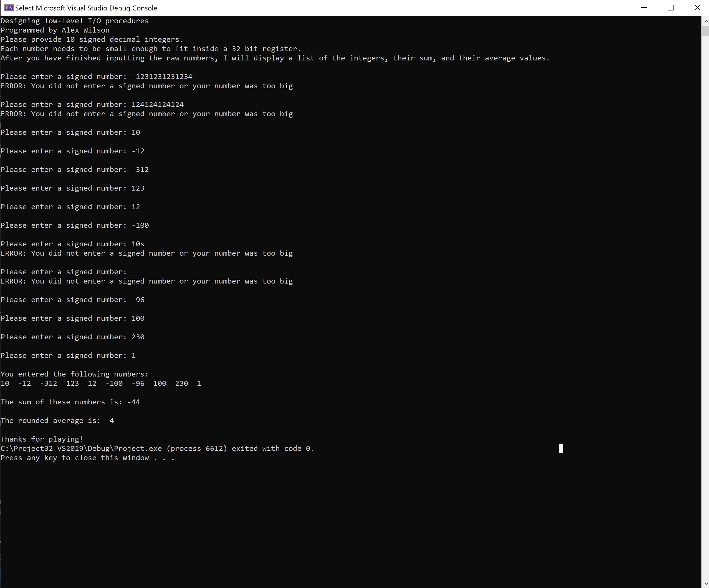

# Low-Level-I-O-procedures
Program written in MASM language to validate integers as signed, sum the valid values, and calculate the average of the values. Implements two I/O procedures:
1. readVal invokes getString macro to get user's input as a string of digits. It then converts the digit string to numberic representation while validating the users input.
      - user input must be valid integer and fit into a 32-bit register 
2. writeVal converts a numberic value to a string of digits and calls displayString macro to produce the output. 
      

## Built With
- Assembly Language
- Microsoft Visual Studio
- Microsoft Macro Assembler
